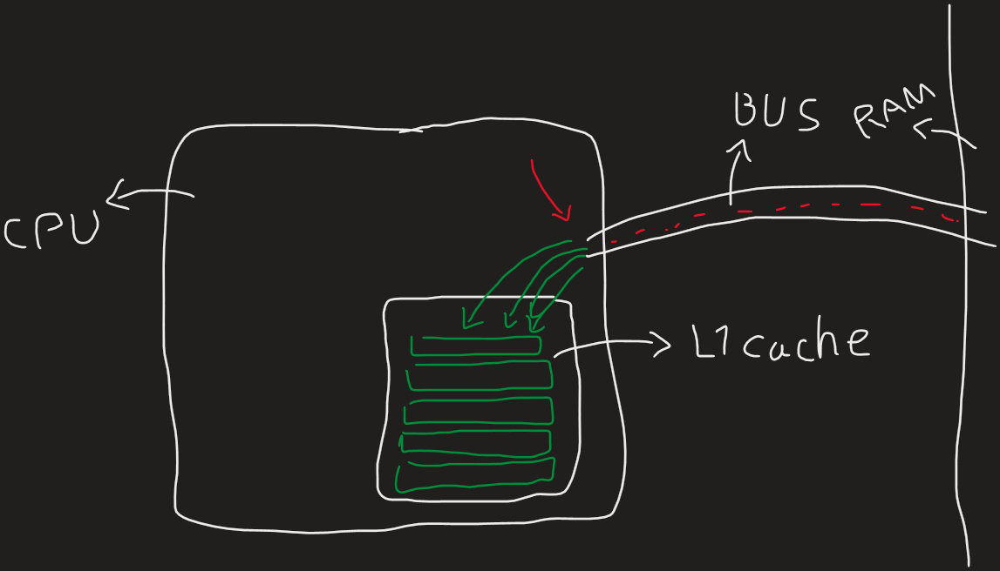
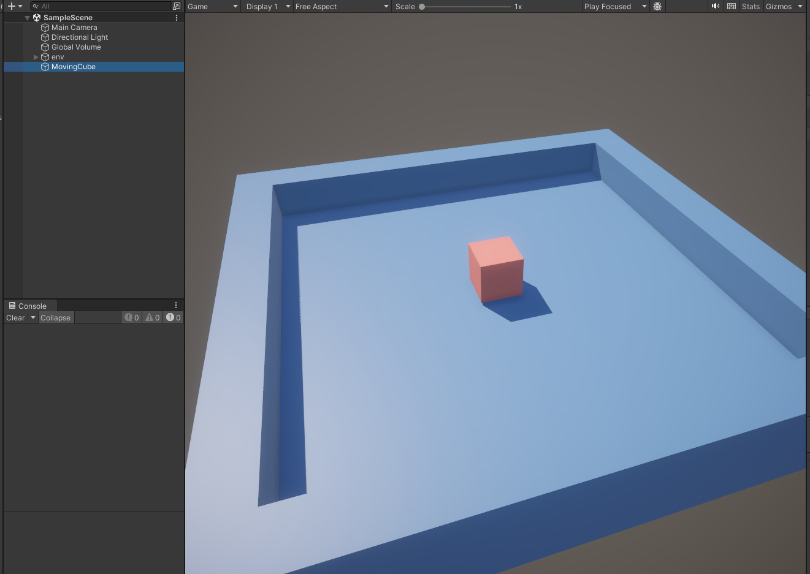
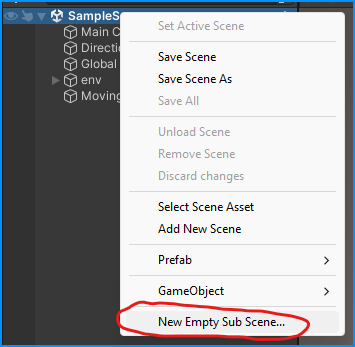
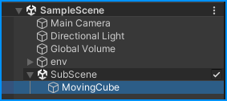
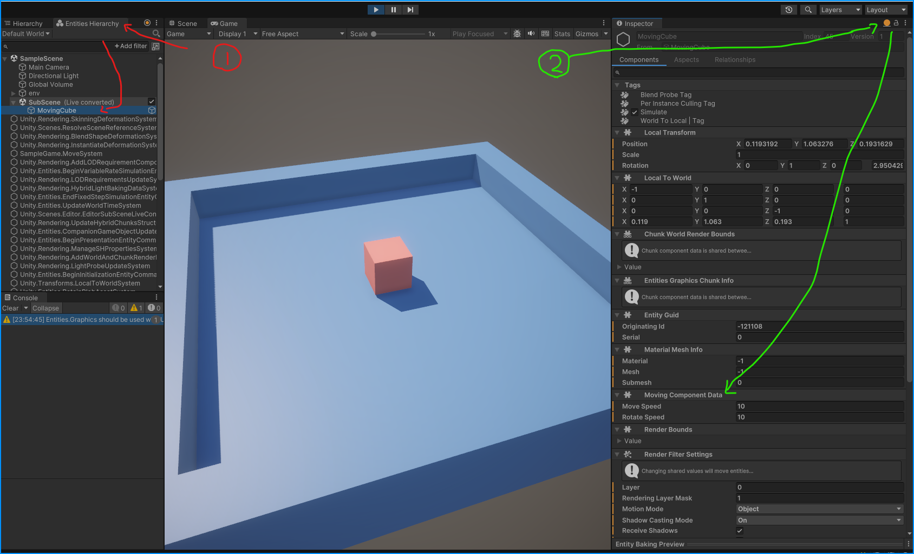
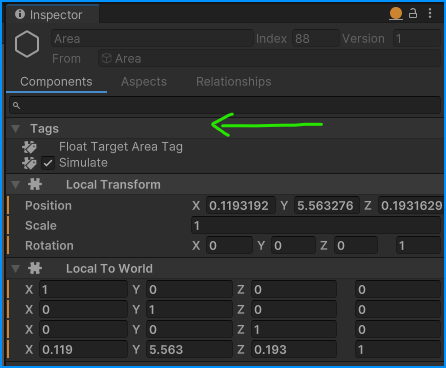
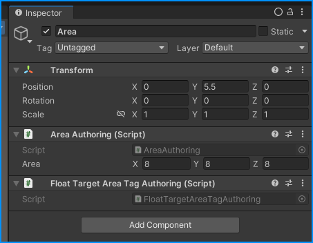
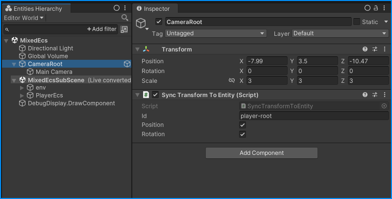
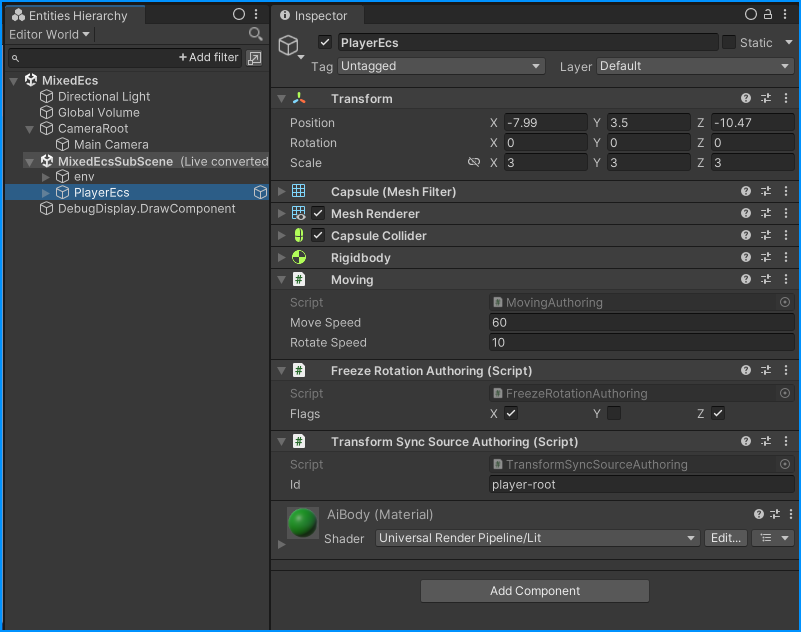
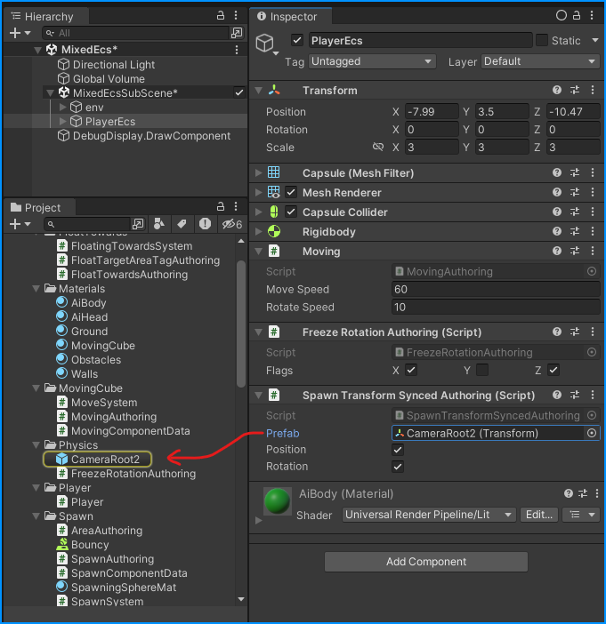

# Start using DOTS in Half an Hour

### Who is this article for?
This article is about essentials needed for getting started with DOTS, and is considered for *advanced users* who are already familiar with Unity but don't know ECS or DOTS.

## Let's Talk Hardware
When CPU gets a data from RAM, the request and data have to go through BUS, which itself takes some time to finish the job. That's why when modern CPUs need a block of data, they don't reach out to RAM at first; instead, they reach out to a set of temporary memories inside their chips called *cache*, there are *L1 cache*, *L2 cache* etc. depending on the CPU model; using these caches are the fastest method of accessing data (1 clock). When CPU can't find the data it needs inside the cache (_cache miss_), it'll need to get data from RAM, it gets a *whole bunch* of them at the same time and stores them inside the L1 cache (or others). 

This is where it becomes clear that having your related data structured one after another makes a big difference, because you'll need to use less transition through BUS. And this is where OOP makes it harder to take advantage of this modern feature.

## OOP VS ECS: Data Structure
In OOP (Object Oriented Programming), your data are mostly saved as reference, so what you store in the cache is basically a pointer to another chunk of data in RAM, forcing another trip through BUS every time you use a reference to a value that's not in the cache. Not only that, but there are lots of tags and metadata associated to each instance of a class and the class itself, taking up chunks of memory and making less room for real data to store in cache. 
In ECS (Entity Component System), your data of same type (components) are stored next to one another, resulting in more useful data in cache and less trips through BUS. It's also important to try to use as little reference type data as possible in the components, so that your component can fully be stored inside cache with no need for a pointer to a far away location inside memory.

## How Does ECS Function?
The architecture in ECS is a bit different than what we've been used to when using OOP. There are *Components*, as nothing but data, literally. Then there are *Entities*, which are just a combination of components. And then there are *Systems*, they use the components attached to entities and *manipulate* them. Perhaps the hardest ideas to get used to is that you can't have private fields inside components anymore, and that your systems will only be *communicating through components*. For some it might also be sad to know that you can't use events either.  

But is it all that bad?   
Your systems are responsible for handling everything, and thanks to the fast nature of ECS, you can have as many systems as you want. So you can create a system just for checking when to play a certain music or just to check whether or not a certain ad-zone is reached. So from the programming side of things, there *are* good alternatives to old OOP ways. And thanks to Unity's powerful Baking phase, the designers can work with the good old Game Objects inside the Edit mode *and* Play mode!

> There are many debates about whether or not ECS is superior to OOP, or if videogames even *need* to worry that much about CPU optimizations when the bottleneck is usually the GPU.

## Installation
Install the packages `Entities` for DOTS's core and `Entities Graphics` for various useful in-editor tools. Make sure you're using Unity 2022 LTS or later because that's when it became production-ready.

## Move Around
For starters, let's make a cube that moves forward-backwards and rotates left-right, like the old Resident Evil games used to do.  
Make the graphics side of things ready; for now, don't give the cube any parent or child.

Then over at scripts, let's start by thinking what components we want... in this case, we need to move the cube by some *moveSpeed* and rotate it by some *rotateSpeed*, so let's create a component for that
```csharp
public struct MovingComponentData : IComponentData {
    public float moveSpeed;
    public float rotateSpeed;
}
```
Notice how it's a `struct` and inherits from `IComponentData`. If you had used a `class` instead, you would've created a *managed* component. That's not necessarily bad, but it's always better to try to use as little managed data as possible in ECS.  
Now, let's create out *Authoring* MonoBehaviour. It's a normal MonoBehaviour, only it doesn't have any systems inside it. just data. It's purpose is to convert to ECS at runtime, but show as a normal Game Object in Edit mode.
```csharp
public class MovingAuthoring : MonoBehaviour {
    public float moveSpeed;
    public float rotateSpeed;
}
```
> It's recommended to use the postfix `Authoring` for your authoring components.

Then we want to write a little nested `Baker` class inside the authoring MonoBehaviour class to convert it into ECS at runtime.
```csharp
public class MovingAuthoring : MonoBehaviour {
    public float moveSpeed;
    public float rotateSpeed;
    
    class MovingBaker : Baker<MovingAuthoring> {
        public override void Bake(MovingAuthoring authoring) {
            // gets the entity associated with the authoring's GameObject
            var entity = GetEntity( TransformUsageFlags.Dynamic );
            // creates a new component for the entity, and sets its values
            AddComponent( entity, new MovingComponentData {
                moveSpeed = authoring.moveSpeed,
                rotateSpeed = authoring.rotateSpeed
            } );
        }
    }
}
```
Note that the `authoring` is the instance of the MonoBehaviour that's being converted.
With this alone, your component will turn into the previously created `MovingCompoenntData` component at runtime.
To see it correctly converting to ECS, make a new SubScene in your scene  
  
And move your main cube inside it.  
  
Now enter play mode. Open Entities Hierarchy window, set Inspector as *Runtime* and you'll see the new `MoveComponentData` is added to your entity. 
  
Now let's add a system to make it work. I'll just write the whole thing here, many of the syntax are self-explanatory, but I'll explain the important parts.
```csharp
// they have to be partial so ECS's source generator can add the rest of the code
public partial struct MoveSystem : ISystem {
    
    // we don't need them yet
    [BurstCompile] public void OnCreate(ref SystemState state) { }
    [BurstCompile] public void OnDestroy(ref SystemState state) { }

    // This updates every frame.
    // the [BurstCompile] attribute tells the compiler to optimize this method using Burst. 
    [BurstCompile] public void OnUpdate(ref SystemState state) {
        // get inputs using old Input system
        var forward = Input.GetAxis( "Vertical" ) * SystemAPI.Time.DeltaTime;
        var rotate = Input.GetAxis( "Horizontal" ) * SystemAPI.Time.DeltaTime;

        // do a query for all entities with MovingComponentData (readonly) and LocalTransform (read-write)
        foreach (var (moving, transform) in SystemAPI.Query<RefRO<MovingComponentData>, RefRW<LocalTransform>>()) {
            // assign the position and rotation of LocalTransform of the entity,
            // using the values from MovingComponentData and the inputs
            transform.ValueRW.Position += transform.ValueRW.Forward() * forward * moving.ValueRO.moveSpeed;
            transform.ValueRW.Rotation = math.mul( quaternion.RotateY( rotate * moving.ValueRO.rotateSpeed ), transform.ValueRO.Rotation ); 
        }
    }
}
```
> Note that we're assigning the code to be optimized by Burst compiler; Burst is a compiler that optimizes your code for the CPU in IL level, and it's very useful for ECS. Coding Burst-Compatible C# is known as HPC#. It's beyond the scope of this tutorial to explain how it works, but just know that it won't work if your method uses managed variables. (more reasons to prioritize the use of value types over reference types for components)

Now, in the code, perhaps the only strange part is the use of `SystemAPI.Query`. That syntax gives all the queried components that have the same entity. So it runs once per entity with `LocalTransform` and `MoveComponentData`; in our case, we only have one.
<video src="out.mp4" controls></video>

## Random & Spawn

Let's spawn a bunch of prefabs in a certain area over time. Let's design the Authoring first
```csharp
public class SpawnAuthoring : MonoBehaviour {
    public GameObject prefab;
    public float spawnRate;
    public Vector3 area;
    
    void OnDrawGizmosSelected() {
        Gizmos.color = Color.red;
        Gizmos.DrawWireCube( transform.position, area );
    }
}
```
Now let's go for the data component
```csharp
public struct SpawnComponentData : IComponentData {
    public Entity prefab;
    public float spawnRate;
    public float nextSpawnTime;
    public Random random;
    public float3 area;
}
```
There are three new things here. `Entity` replaces `GameObject` as the reference to a prefab. `Random` is a struct from `Unity.Mathematics` that's burst-compatible, and `float3` is the burst-compatible version of `Vector3` (also from `Unity.Mathematics`).
Here's how the baker would look like
```csharp
class SpawnBaker : Baker<SpawnAuthoring> {
    public override void Bake(SpawnAuthoring authoring) {
        var entity = GetEntity( TransformUsageFlags.Dynamic );
        AddComponent( entity, new SpawnComponentData {
            area = authoring.area,
            prefab = GetEntity( authoring.prefab, TransformUsageFlags.Dynamic ),
            spawnRate = authoring.spawnRate,
            random = new Random( (uint)new System.Random().Next() ),
            nextSpawnTime = 0
        } );
    }
}
```
The only new thing here is the conversion of prefab `GameObject` to an `Entity` by using `GetEntity` method. Easy enough. Now let's get down to the System.
```csharp
public partial struct SpawnSystem : ISystem {
    [BurstCompile] public void OnCreate(ref SystemState state) => 
        state.RequireForUpdate<BeginSimulationEntityCommandBufferSystem.Singleton>();

    [BurstCompile] public void OnUpdate(ref SystemState state) {
        
        // create a entity command buffer to execute commands at the right time
        var ecbSingleton = SystemAPI.GetSingleton<BeginSimulationEntityCommandBufferSystem.Singleton>();
        var ecb = ecbSingleton.CreateCommandBuffer( state.WorldUnmanaged );
        
        foreach (var spawn in SystemAPI.Query<RefRW<SpawnComponentData>>()) {
            if (SystemAPI.Time.ElapsedTime > spawn.ValueRW.nextSpawnTime) {
                spawn.ValueRW.nextSpawnTime = (float)(SystemAPI.Time.ElapsedTime + spawn.ValueRW.spawnRate);
                
                // instantiate a new entity from the prefab
                var entity = ecb.Instantiate( spawn.ValueRW.prefab );
                
                // assign transform component to the entity
                var pos = spawn.ValueRW.random.NextFloat3( -spawn.ValueRW.area, spawn.ValueRW.area );
                var localTransformComponent = LocalTransform.FromPosition( pos );
                ecb.AddComponent( entity, localTransformComponent );
            }
        }
    }
}
```
Ok, quite a few concepts right here. first off, `ecb` or Entity Command Buffer is responsible for executing entity-related commands like instantiation, adding component or removing components, set entity names or destroying them etc. And by using `BeginSimulationEntityCommandBufferSystem`'s command buffer, we're using one of the built-in command buffers that's executed at the beginning of the simulation. There are also `EndSimulationEntityCommandBufferSystem` and `BeginFixedStepSimulationEntityCommandBufferSystem` (and others) you could use, each with self-explanatory name. You can also create your own command buffer.  
You might have noticed that we're using `OnCreate` this time. That's because now we need the `BeginSimulationEntityCommandBufferSystem` to be created before our system. We could specify anything that our system depends on with the `RequireForUpdate` method. For instance we could specify that we *need* there to be a `SpawnComponentData` for our system t start working, in which case we'd add `state.RequireForUpdate<SpawnComponentData>()` to our `OnUpdate` as well.   
The query part doesn't have anything worth noting.  
This is the result of the spawner system:  
<video src="out2.mp4" controls></video>  
Notice how it doesn't respect the local position of our Authoring. Let's fix that
```csharp
foreach (var (spawn, transform) in SystemAPI.Query<RefRW<SpawnComponentData>, RefRW<LocalTransform>>()) {
    if (SystemAPI.Time.ElapsedTime > spawn.ValueRW.nextSpawnTime) {
        spawn.ValueRW.nextSpawnTime = (float)(SystemAPI.Time.ElapsedTime + spawn.ValueRW.spawnRate);
        
        // instantiate a new entity from the prefab
        var entity = ecb.Instantiate( spawn.ValueRW.prefab );
        
        // assign transform component to the entity
        var randomPoint = spawn.ValueRW.random.NextFloat3( -spawn.ValueRW.area / 2f, spawn.ValueRW.area / 2f );
        var pos = transform.ValueRW.TransformPoint( randomPoint ); // local to world space
        var localTransformComponent = LocalTransform.FromPosition( pos );
        ecb.AddComponent( entity, localTransformComponent );
    }
}
```
Now we're converting our local space random point to world space by using the `LocalTransform` of the entity, just like how we'd do in regular MonoBehaviour.
<video src="out3.mp4" controls></video>  
Let's also make it support local rotation and scale. First on the authoring side. how the Gizmo would draw it
```csharp
void OnDrawGizmosSelected() {
    Gizmos.color = Color.red;
    Gizmos.matrix = transform.localToWorldMatrix;
    Gizmos.DrawWireCube( Vector3.zero, area );
}
```
<video src="out4.mp4" controls></video>  

And then no changes needed for the system as it's already using the built-in local-to-world conversion algorithm inside `LocalTransform`;

<video src="out5.mp4" controls></video>  

Notice how the scale doesn't really work? That's because in ECS there's only uniform scaling, so you can't have fine controls over each axis of your local scale. Instead, we can get around this by modifying the `area` in the baker to respect the scale of the `authoring.transform`
```csharp
class SpawnBaker : Baker<SpawnAuthoring> {
    public override void Bake(SpawnAuthoring authoring) {
        // convert child space area to local space
        var scale = authoring.transform.localScale;
        var area = new float3( 
            scale.x * authoring.area.x,
            scale.y * authoring.area.y,
            scale.z * authoring.area.z );
        
        var entity = GetEntity( TransformUsageFlags.Dynamic );
        AddComponent( entity, new SpawnComponentData {
            area = area,
            prefab = GetEntity( authoring.prefab, TransformUsageFlags.Dynamic ),
            spawnRate = authoring.spawnRate,
            random = new Random( (uint)new System.Random().Next() ),
            nextSpawnTime = 0
        } );
    }
}
```
<video src="out-1.mp4" controls></video>

## Physics!
We need to install **Unity Physics** package first.  
Then assign physics to the spawning spheres as you'd normally do. Nothing new about this one.  

<video src="out-2.mp4" controls></video>

Now let's modify out movement system so instead of moving by LocalTransform, it moves by physics.
```csharp
// runs every fixed update
[UpdateInGroup(typeof(FixedStepSimulationSystemGroup))]
public partial struct MoveSystem : ISystem {

    [BurstCompile] public void OnUpdate(ref SystemState state) {
        // get inputs using old Input system
        var forward = Input.GetAxis( "Vertical" ) * SystemAPI.Time.DeltaTime;
        var rotate = Input.GetAxis( "Horizontal" ) * SystemAPI.Time.DeltaTime;

        // iterate over all entities that have MovingComponentData, LocalTransform, PhysicsVelocity and PhysicsMass
        foreach (var (moving, transform, physicsVelocity, physicsMass) in SystemAPI.Query<
                     RefRO<MovingComponentData>, RefRW<LocalTransform>,
                     RefRW<PhysicsVelocity>, RefRW<PhysicsMass>>()) 
        {
            // assign force to move object
            var moveImpulse = transform.ValueRW.Forward() * forward * moving.ValueRO.moveSpeed;
            physicsVelocity.ValueRW.ApplyLinearImpulse( physicsMass.ValueRO, moveImpulse );

            // assign force to rotate object
            var rotationImpulse = rotate * moving.ValueRO.rotateSpeed;
            physicsVelocity.ValueRW.ApplyAngularImpulse( physicsMass.ValueRO, new float3( 0, rotationImpulse, 0 ) );
        }
    }
}
```
Note the `UpdateInGroup` attribute and the query have changed. We're using some of the Physics components and the `ApplyLinearImpulse` and `ApplyAngularImpulse` are extension methods from `Unity.Physics.Extensions.PhysicsComponentExtensions` that manipulate the `PhysicsVelocity` component.

</video><video src="out-3.mp4" controls></video>

There's nothing stopping us from manipulating the `PhysicsVelocity` directly though, we could just assign he velocity like we could with old `Rigidbody` components.

```csharp
foreach (var (moving, transform, physicsVelocity) in SystemAPI.Query<
             RefRO<MovingComponentData>, RefRW<LocalTransform>,
             RefRW<PhysicsVelocity>>()) 
{
    // move
    var moveImpulse = transform.ValueRW.Forward() * forward * moving.ValueRO.moveSpeed;
    physicsVelocity.ValueRW.Linear = moveImpulse;
    
    // rotate
    var rotationImpulse = rotate * moving.ValueRO.rotateSpeed;
    physicsVelocity.ValueRW.Angular = rotationImpulse;
}
```
But just like in `Rigidbody`, we need to be careful with this.  

<video src="out-4.mp4" controls></video>

## Army of Spheres ( and referencing )

DOTS is *perfect* for mass data manipulation, so let's make an army of spheres pushing their way towards a random point in a area!  
We need to spawn from multiple places, then have a singleton *Area*-like component as the spheres' target, then each sphere finds a random point inside that *Area* and move towards it using physics.  
Let's start by breaking down the *Spawner* into two components, one *Spawn* and one *Area*.  
ComponentDatas:
```csharp
public struct SpawnComponentData : IComponentData {
    public Entity prefab;
    public float spawnRate;
    public int spawnCount;
    public float nextSpawnTime;
    public Random random;
}

[Serializable]
public struct AreaComponentData : IComponentData {
    public float3 area;
}
```
Authorings:
```csharp
public class AreaAuthoring : MonoBehaviour {
    public Vector3 area;
    
    void OnDrawGizmosSelected() {
        Gizmos.color = Color.red;
        Gizmos.matrix = transform.localToWorldMatrix;
        Gizmos.DrawWireCube( Vector3.zero, area );
    }

    class AreaBaker : Baker<AreaAuthoring> {
        public override void Bake(AreaAuthoring authoring) {
            var entity = GetEntity( TransformUsageFlags.Dynamic );
            // convert child space area to local space
            var scale = authoring.transform.localScale;
            var area = new float3( 
                scale.x * authoring.area.x,
                scale.y * authoring.area.y,
                scale.z * authoring.area.z );
            AddComponent( entity, new AreaComponentData {
                area = area
            } );
        }
    }
}
```  
```csharp
[RequireComponent(typeof(AreaAuthoring))]
public class SpawnAuthoring : MonoBehaviour {
    public GameObject prefab;
    public float spawnRate;
    public int spawnCount;


    class SpawnBaker : Baker<SpawnAuthoring> {
        public override void Bake(SpawnAuthoring authoring) {
            var entity = GetEntity( TransformUsageFlags.Dynamic );
            AddComponent( entity, new SpawnComponentData {
                prefab = GetEntity( authoring.prefab, TransformUsageFlags.Dynamic ),
                spawnRate = authoring.spawnRate,
                random = new Random( (uint)new System.Random().Next() ),
                spawnCount = authoring.spawnCount,
                nextSpawnTime = 0
            } );
        }
    }
}
```  
and this would be the spawner system's `OnUpdate`:
```csharp
public void OnUpdate(ref SystemState state) {    
    var ecbSingleton = SystemAPI.GetSingleton<BeginSimulationEntityCommandBufferSystem.Singleton>();
    var ecb = ecbSingleton.CreateCommandBuffer( state.WorldUnmanaged );
    
    foreach (var (transform, spawn, area) in SystemAPI.Query<RefRW<LocalTransform>, RefRW<SpawnComponentData>, RefRO<AreaComponentData>>()) {
        if (SystemAPI.Time.ElapsedTime > spawn.ValueRW.nextSpawnTime) {
            spawn.ValueRW.nextSpawnTime = (float)(SystemAPI.Time.ElapsedTime + spawn.ValueRW.spawnRate);
            
            var entity = ecb.Instantiate( spawn.ValueRW.prefab );
            var randomPoint = spawn.ValueRW.random.NextFloat3( -area.ValueRO.area / 2f, area.ValueRO.area / 2f );
            var pos = transform.ValueRW.TransformPoint( randomPoint ); // local to world space
            var localTransformComponent = LocalTransform.FromPosition( pos );
            ecb.AddComponent( entity, localTransformComponent );
        }
    }
}
```  
Now let's make a few spawners in the scene for spheres to spawn from. 

<video src="out-5.mp4" controls></video>

Now to make them go towards the blue boxes, we need to make a system that's responsible for moving objects towards a random point in an area, and change that point every few moments. Here's the authoring and component data: 

```csharp
public struct FloatTowardsComponentData : IComponentData {
    public float speed;
    public float reTargetRate;
    public Entity targetArea;
    public float3 targetPoint;
    public float nextReTargetTime;
    public Random random;
}

public class FloatTowardsAuthoring : MonoBehaviour {
    public float speed;
    public float reTargetRate;
    public AreaAuthoring targetArea;
    
    class FloatTowardsBaker : Baker<FloatTowardsAuthoring> {
        public override void Bake(FloatTowardsAuthoring authoring) {
            var entity = GetEntity( TransformUsageFlags.Dynamic );
            AddComponent( entity,
                new FloatTowardsComponentData {
                    speed = authoring.speed,
                    reTargetRate = authoring.reTargetRate,
                    targetArea = GetEntity( authoring.targetArea, TransformUsageFlags.Dynamic )و
                    random = new Random( (uint)new System.Random().Next() )
                } );
        }
    }
}
```  
Notice that we're using `Entity` for the target area, as we need it to remain a reference-like value, because we need to use it like a normal reference inside Editor.  
This is what the system will look like:  

```csharp
[BurstCompile] public void OnUpdate(ref SystemState state) {
    foreach (var (floatTowards, physicsVelocity, physicsMass, transform) in SystemAPI.Query<
                 RefRW<FloatTowardsComponentData>,
                 RefRW<PhysicsVelocity>,
                 RefRO<PhysicsMass>,
                 RefRW<LocalTransform>>()) 
    {
        // new random point
        if (SystemAPI.Time.ElapsedTime > floatTowards.ValueRO.nextReTargetTime) {
            floatTowards.ValueRW.nextReTargetTime = (float)(SystemAPI.Time.ElapsedTime + floatTowards.ValueRO.reTargetRate);
            var targetArea = SystemAPI.GetComponent<AreaComponentData>( floatTowards.ValueRO.targetArea );
            var point = floatTowards.ValueRW.random.NextFloat3( -targetArea.area / 2f, targetArea.area / 2f );
            floatTowards.ValueRW.targetPoint = = transform.ValueRW.TransformPoint( point );
        }
        
        // move towards point
        var direction = math.normalize( floatTowards.ValueRO.targetPoint - transform.ValueRO.Position );
        var moveImpulse = direction * floatTowards.ValueRO.speed;
        physicsVelocity.ValueRW.ApplyLinearImpulse( physicsMass.ValueRO, transform.ValueRO.Scale, moveImpulse );
    }
}
```  

And for now, since we need to reference the target area from Editor, we're forced to move the prefab in the SubScene and connect the reference from there, and then spawning that object instead of the prefab, like so:

<video src="out-6.mp4" controls></video>

And the result should look something like this: 

<video src="out-7.mp4" controls></video>

Looks good, but this isn't a good practice, we need to come up with an approach that doesn't need moving our prefabs inside the SubScene in Editor. Here's where *Singletons* become handy! Let's create a tag for out target area and remove the referencing Entity from our previous component data.  

```csharp
public struct FloatTowardsComponentData : IComponentData {
    public float speed;
    public float reTargetRate;
    public float3 targetPoint;
    public float nextReTargetTime;
    public Random random;
}

public struct FloatTargetAreaTag : IComponentData { }
``` 

> Tags are `IComponentData`s with no fields. They appear specially above all other components inside the Editor 

Then we can just create an Authoring for it and assign the component to the target area game object. 

```csharp
public class FloatTargetAreaTagAuthoring : MonoBehaviour {
    class FloatTargetAreaTagBaker : Baker<FloatTargetAreaTagAuthoring> {
        public override void Bake(FloatTargetAreaTagAuthoring authoring) {
            var entity = GetEntity( TransformUsageFlags.Dynamic );
            AddComponent( entity, new FloatTargetAreaTag() );
        }
    }
}
```


As for system, here's the modified version that uses singleton pattern to retrieve the target area (using the tag):

```csharp
[UpdateInGroup(typeof(FixedStepSimulationSystemGroup))]
public partial struct FloatingTowardsSystem : ISystem {
    
    [BurstCompile] public void OnCreate(ref SystemState state) => 
        state.RequireForUpdate<FloatTargetAreaTag>();

    [BurstCompile] public void OnUpdate(ref SystemState state) {

        var tagEntity = SystemAPI.GetSingletonEntity<FloatTargetAreaTag>();
        var targetArea = SystemAPI.GetComponent<AreaComponentData>( tagEntity );
        
        foreach (var (floatTowards, physicsVelocity, physicsMass, transform) in SystemAPI.Query<
                     RefRW<FloatTowardsComponentData>,
                     RefRW<PhysicsVelocity>,
                     RefRO<PhysicsMass>,
                     RefRW<LocalTransform>>()) 
        {
            // new random point
            if (SystemAPI.Time.ElapsedTime > floatTowards.ValueRO.nextReTargetTime) {
                floatTowards.ValueRW.nextReTargetTime = (float)(SystemAPI.Time.ElapsedTime + floatTowards.ValueRO.reTargetRate);
                var point = floatTowards.ValueRW.random.NextFloat3( -targetArea.area / 2f, targetArea.area / 2f );
                floatTowards.ValueRW.targetPoint = = transform.ValueRW.TransformPoint( point );
            }
            
            // move towards point
            var direction = math.normalize( floatTowards.ValueRO.targetPoint - transform.ValueRO.Position );
            var moveImpulse = direction * floatTowards.ValueRO.speed;
            physicsVelocity.ValueRW.ApplyLinearImpulse( physicsMass.ValueRO, transform.ValueRO.Scale, moveImpulse );
        }
    }
}
```
Notice that we're using `RequireForUpdate` to make sure that the system is only updated when one instance of the tag exists. I did that and updated some physics material, and tweaked some of the properties to get a cool looking, insect-like movement.

<video src="out-8.mp4" controls></video>

All of these are running in a single thread, so let's make it multi-threaded by using *Jobs* system. Jobs is part of the DOTS and is Burst-compatible if we follow some guidelines, mostly about using just unmanaged types and placing the right attributes. There are a few `Job` options we could use, the one that we're going to use is `IJobEntity`; this job is the easiest to work with; the special point of it is that you write the parameters you need, and Jobs will generate the rest of the code for you (You can view the generated sources in /Temp directory of your project).  
Here's how the `FloatTowardsSystem` will look like:  

```csharp
[UpdateInGroup(typeof(FixedStepSimulationSystemGroup))]

public partial struct FloatingTowardsSystem : ISystem {
    
    [BurstCompile] public void OnCreate(ref SystemState state) => 
        state.RequireForUpdate<FloatTargetAreaTag>();

    [BurstCompile] public void OnUpdate(ref SystemState state) {
        var tagEntity = SystemAPI.GetSingletonEntity<FloatTargetAreaTag>();
        var targetArea = SystemAPI.GetComponent<AreaComponentData>( tagEntity );
        var targetAreaTransform = SystemAPI.GetComponent<LocalTransform>( tagEntity );
        
        // scheduling the job to execute in parallel (multiple threads)
        new FloatingTowardsSystemJob {
            elapsedTime = SystemAPI.Time.ElapsedTime,
            targetArea = targetArea,
            targetAreaTransform = targetAreaTransform
        }.ScheduleParallel();
    }


    [BurstCompile] public partial struct FloatingTowardsSystemJob : IJobEntity {
        
        [ReadOnly] public AreaComponentData targetArea;
        public LocalTransform targetAreaTransform;
        public double elapsedTime;
        
        // defining our query parameters here as 'ref' or 'in'
        [BurstCompile] void Execute(
            ref FloatTowardsComponentData floatTowards, ref PhysicsVelocity physicsVelocity,
            in PhysicsMass physicsMass, ref LocalTransform transform) 
        {
            // new random point
            if (elapsedTime > floatTowards.nextReTargetTime) {
                floatTowards.nextReTargetTime = (float)(elapsedTime + floatTowards.reTargetRate);
                var point = floatTowards.random.NextFloat3( -targetArea.area / 2f, targetArea.area / 2f );
                floatTowards.targetPoint = targetAreaTransform.TransformPoint( point );
            }

            // move towards point
            var direction = math.normalize( floatTowards.targetPoint - transform.Position );
            var moveImpulse = direction * floatTowards.speed;
            physicsVelocity.ApplyLinearImpulse( physicsMass, transform.Scale, moveImpulse );
        }
    }
}
```  

Notice that the job class is *partial*, it's because the other part of it is going to be written in in source generation process. We write the query parameters we need as the `Execute` arguments, and the source gen will handle the query part for us. And as for the local fields, they serve as parameters for the job, which we're injecting from the system; Also notice that we can't use `SystemAPI.Time` in the job, so we're passing it as a parameter instead.  
And then finally, the `ScheduleParallel`, as it's name suggests, marks the job to be executed in parallel.  
> Don't forget to mark burst-compatible functions and types as [BurstCompile]. The perfromance boost is worth it.

That's it, the system is now multi-threaded.

## Connection with MonoBehaviours

There are some things you either just can't do with ECS, or you can do a lot easier using regular MonoBehaviours. So you'll need to come up with some way of letting the two world communicate. There are a few ways you can do this, but none of them are officially better than the other.  
Let's go through them with an example. Use the physically based movement system to move a cylinder around. And then we'll make a GameObject Camera follow the moving cylinder. Here's what I've set up as the scene:

<video src="out-9.mp4" controls></video>

> The Freeze constraints inside Rigidbody don't work for ECS yet, so I've used a custom component to freeze the rotation.
> ```csharp
> public struct FreezeRotationComponentData : IComponentData {
>     public bool3 Flags;
> }
> 
> [DisallowMultipleComponent]
> [RequireComponent(typeof(Rigidbody))]
> public class FreezeRotationAuthoring : MonoBehaviour {
>     public bool3 Flags;
> 
>     class FreezeRotationBaker : Baker<FreezeRotationAuthoring> {
>         public override void Bake(FreezeRotationAuthoring authoring) {
>             var entity = GetEntity( TransformUsageFlags.Dynamic );
>             AddComponent( entity, new FreezeRotationComponentData {
>                 Flags = authoring.Flags
>             } );
>         }
>     }
> }
> 
> public partial struct FreezeRotationSystem : ISystem {
>     public void OnUpdate(ref SystemState state) {
>          foreach (var (freeRot, pmass) in SystemAPI.Query<
>              RefRO<FreezeRotationComponentData>, RefRW<PhysicsMass>>()) 
>         {
>             if (freeRot.ValueRO.Flags.x) pmass.ValueRW.InverseInertia.x = 0f;
>             if (freeRot.ValueRO.Flags.y) pmass.ValueRW.InverseInertia.y = 0f;
>             if (freeRot.ValueRO.Flags.z) pmass.ValueRW.InverseInertia.z = 0f;
>         }
>     }
> }
> ```

Now we need to get the position from the player entity's `LocalTransform` in a MonoBehaviour system, so then we can use it to adjust the camera the old-way. Here's where the multiple choices come to play. (The order is not based on any superiority)

### Sync from Systems using identifiers

We can sync data from ECS to MonoBehaviour by, saving a list of all instances of a certain MonoBehaviour Component, and then assigning the data to them in a System, from a certain linked component, based on some form of identification. For example, here's an example that uses a `FixedString32Bytes` as the identifier.  

```csharp
public class SyncTransformToEntity : MonoBehaviour {
    public string id;
    public bool position = true;
    public bool rotation = true;


    public static readonly List<SyncTransformToEntity> Instances = new();

    void Awake() => Instances.Add( this );
    void OnDisable() => Instances.Remove( this );
}
```
```csharp
public struct TransformSyncSource : IComponentData {
    public FixedString32Bytes id;
}

public class TransformSyncSourceAuthoring : MonoBehaviour {
    public string id;
    
    class TargetTransformBaker : Baker<TransformSyncSourceAuthoring> {
        public override void Bake(TransformSyncSourceAuthoring syncSourceAuthoring) {
            var entity = GetEntity( TransformUsageFlags.Dynamic );
            AddComponent( entity, new TransformSyncSource {
                id = syncSourceAuthoring.id
            } );
        }
    }
}

public partial struct SyncTransformSystem : ISystem {
    public void OnUpdate(ref SystemState state) {
        foreach (var (constraint, transform) in SystemAPI.Query<
                     RefRO<TransformSyncSource>, RefRO<LocalTransform>>()) 
        {
            for (int i = 0; i < SyncTransformToEntity.Instances.Count; i++) {
                if (SyncTransformToEntity.Instances[i].id == constraint.ValueRO.id) {
                    if (SyncTransformToEntity.Instances[i].position)
                        SyncTransformToEntity.Instances[i].transform.position = transform.ValueRO.Position;
                    if (SyncTransformToEntity.Instances[i].rotation)
                        SyncTransformToEntity.Instances[i].transform.rotation = transform.ValueRO.Rotation;
                }
            }
        }
    }
}
```

> When you use managed/references in your System, it'll no longer be Burst-Compatible 

I then assign the **SyncTransformToEntity** component to the GameObject that I want synced with Entity's, and give it some id.
  

Then I assign a **TransformSyncSourceAuthoring** to the Entity source, with the same id.  


<video src="out-10.mp4" controls ></video>

### Spawn GameObjects from Systems

You can spawn GameObjects from an ECS System, taking reference from a managed Component, and then assign the transform values of the spawned GameObject using that newly found reference (the instantiated Object)

```csharp
public class SpawnGameObjectSynced : IComponentData {
    public Transform instance;
    public bool spawned;
    public bool position;
    public bool rotation;
}

public class SpawnTransformSyncedAuthoring : MonoBehaviour {
    public Transform prefab;
    public bool position;
    public bool rotation;


    class SpawnGameObjectSyncedBaker : Baker<SpawnTransformSyncedAuthoring> {
        public override void Bake(SpawnTransformSyncedAuthoring authoring) {
            var entity = GetEntity( TransformUsageFlags.Dynamic );
            AddComponentObject( entity, new SpawnGameObjectSynced {
                instance = authoring.prefab,
                position = authoring.position,
                rotation = authoring.rotation
            } );
        }
    }
}

public partial struct SpawnGameObjectSyncedSystem : ISystem {
    public void OnUpdate(ref SystemState state) {
        foreach (var (spawn, transform) in SystemAPI.Query<
                     SpawnGameObjectSynced, RefRO<LocalTransform>>()) 
        {
            if (spawn.instance != null) {
                // spawn
                if (!spawn.spawned) {
                    spawn.instance = Object.Instantiate( spawn.instance );
                    spawn.spawned = true;
                }
                // sync
                if (spawn.position)
                    spawn.instance.transform.position = transform.ValueRO.Position;
                if (spawn.rotation)
                    spawn.instance.transform.rotation = transform.ValueRO.Rotation;
            }
        }
    }
}
```

I then use it like so:  


Note that this will force you to create a prefab from your GameObjects you want synced.  
The results are the same, so I won't include the video.

### Custom Authoring (Limited Usage)

In cases where you want just a certain few amount of predefined components in an Entity, you can create and populate your entity directly from your MonoBehaviour script, and simulate the Baking process yourself. 

```csharp
public class CustomAuthoringExample : MonoBehaviour {
    EntityManager _entityManager;
    Entity _entity;

    void OnEnable() {
        _entityManager = World.DefaultGameObjectInjectionWorld.EntityManager;
        
        // create entity
        _entity = _entityManager.CreateEntity();
        
        // populate entity with components
        var localTransform = LocalTransform.FromPositionRotationScale( 
            transform.position, transform.rotation, transform.localScale.x );
        _entityManager.AddComponentData( _entity, localTransform );
        // ...
    }

    void Update() {
        // use components 
        var localTransform = _entityManager.GetComponentData<LocalTransform>( _entity );
        // ...
    }
}
```

This process will not expand well, and can only be used when the entity is simple enough to add all of it's components through code. But in our example, we have a player with lots of components, *and* a child sunglasses object, so it'll take a very long time to write it all in code, and I won't do it. Use this technique only when you have a very simple entity; (i.e. maybe you just want to take advantage of System's parallel Jobs to process some mass data)


## Footer

That's it for the starters guide, I hope you learned something new, and I hope you'll follow up on the ECS documentation to learn more about it, it's really an amazing system! 
All sample codes from this project are available in the github repository [https://github.com/somedeveloper00/DotsSample](https://github.com/somedeveloper00/DotsSample), so you can download and try them out yourself.    
If you have any questions, or you want to correct some part of this project, feel free to contact me via [email](mailto:barari.saeed.am@gmail.com) or create a pull request.

- [ECS Documentation](https://docs.unity3d.com/Packages/com.unity.entities@1.0/manual/systems-overview.html)
- [ECS Samples](https://github.com/Unity-Technologies/EntityComponentSystemSamples)

Project by Saeed Barari.  
